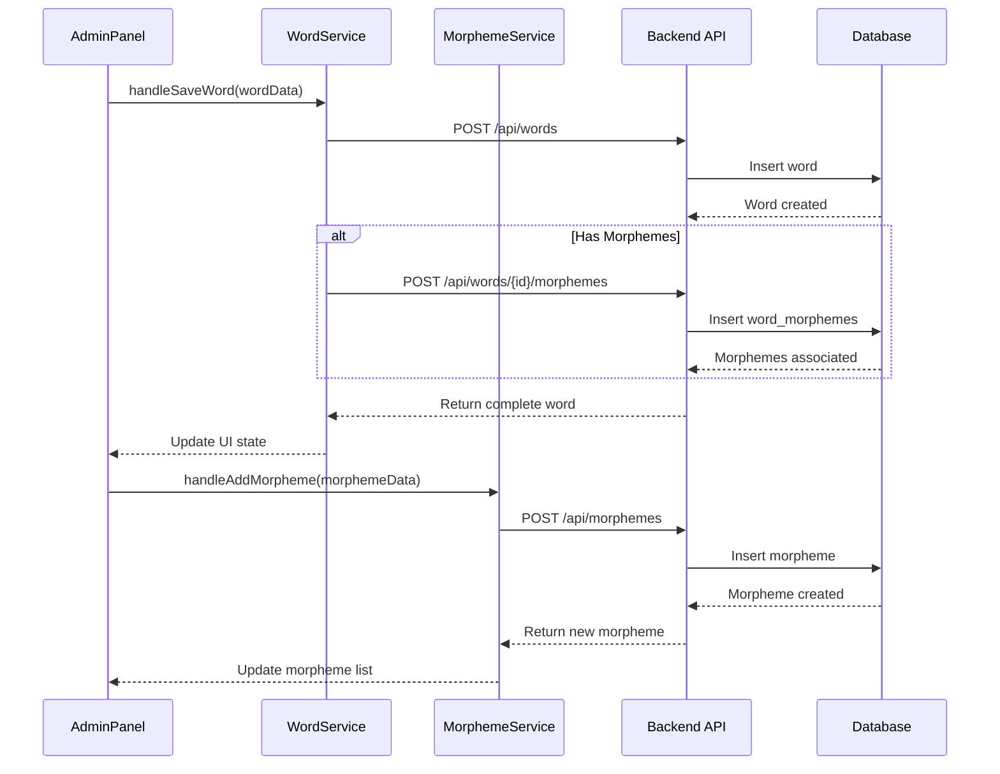

# Admin Panel Integration Plan

## Overview
This document outlines the plan for integrating the admin panel with the backend services for word and morpheme management.

## Data Flow Diagram


## Implementation Steps

### 1. Frontend Service Enhancements

#### WordService Updates
```typescript
interface WordWithMorphemes extends Word {
  morphemes: {
    id: string;
    position: number;
  }[];
}

// New method for word creation with morphemes
async createWord(wordData: WordWithMorphemes): Promise<Word>
```

#### MorphemeService Creation
```typescript
interface MorphemeCreate {
  text: string;
  type: 'prefix' | 'root' | 'suffix' | 'infix';
  meaning: string;
  examples?: string;
}

async createMorpheme(data: MorphemeCreate): Promise<Morpheme>
async searchMorphemes(query: string): Promise<Morpheme[]>
```

### 2. AdminPanel Component Updates

```typescript
// New state for API interaction
const [isLoading, setIsLoading] = useState(false);
const [error, setError] = useState<string | null>(null);
const [successMessage, setSuccessMessage] = useState<string | null>(null);

// Enhanced save handler
const handleSaveWord = async () => {
  setIsLoading(true);
  setError(null);
  try {
    const wordWithMorphemes = {
      ...wordForm,
      morphemes: morphemes.map((m, idx) => ({
        id: m.id,
        position: idx
      }))
    };
    await wordService.createWord(wordWithMorphemes);
    setSuccessMessage('Word saved successfully!');
    resetForm();
  } catch (err) {
    setError('Failed to save word. Please try again.');
  } finally {
    setIsLoading(false);
  }
};
```

### 3. UI Enhancements
- Add loading spinners during API calls
- Show success/error messages
- Add validation before submission
- Implement auto-complete for morpheme search

```typescript
const [morphemeSearchResults, setMorphemeSearchResults] = useState([]);

const handleMorphemeSearch = async (query: string) => {
  const results = await morphemeService.searchMorphemes(query);
  setMorphemeSearchResults(results);
};
```

### 4. Backend API Endpoints (Already Implemented)
- POST /api/words - Create new word
- POST /api/words/{id}/morphemes - Associate morphemes
- POST /api/morphemes - Create new morpheme
- GET /api/morphemes/search - Search morphemes

### 5. Error Handling & Validation

```typescript
const validateWord = (word: WordWithMorphemes): string[] => {
  const errors = [];
  if (!word.text) errors.push('Word text is required');
  if (!word.definition) errors.push('Definition is required');
  if (!word.partOfSpeech) errors.push('Part of speech is required');
  return errors;
};
```

### 6. Testing Plan
- Unit tests for new service methods
- Integration tests for API endpoints
- E2E tests for admin panel workflows

## Next Steps
1. Implement frontend service enhancements
2. Update AdminPanel component with API integration
3. Add UI feedback elements
4. Implement validation
5. Write tests
6. Manual testing and bug fixes