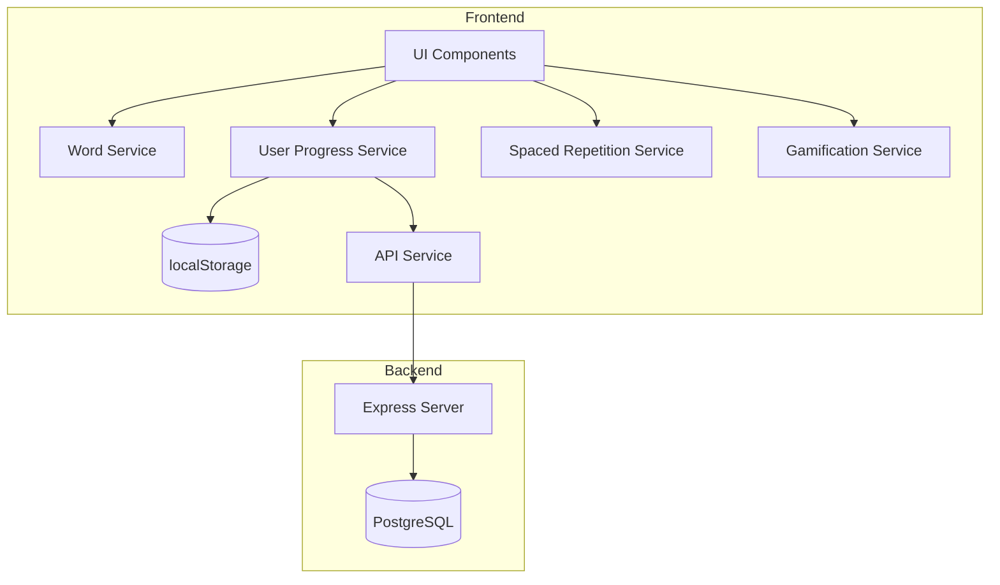
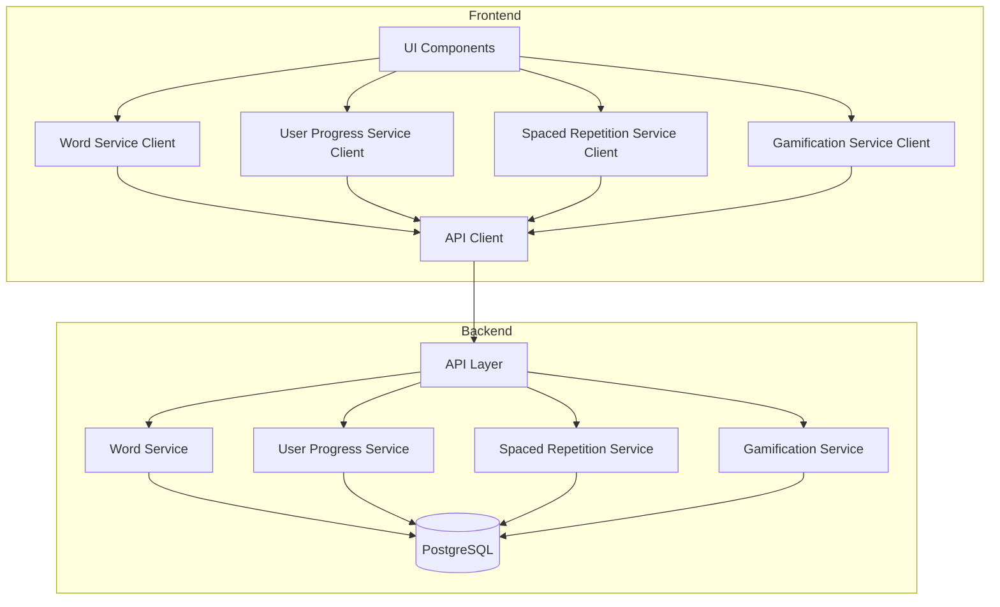
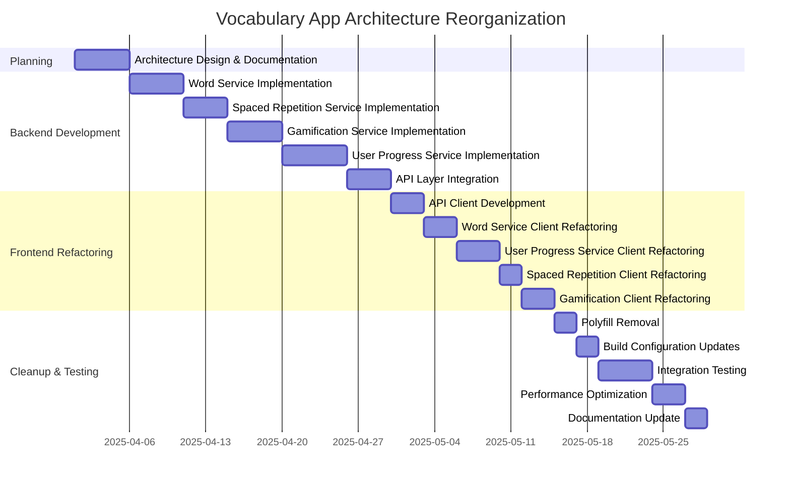

# Vocabulary App Architecture Reorganization Plan

## Table of Contents

- [Current Architecture Analysis](#current-architecture-analysis)
- [Proposed Architecture](#proposed-architecture)
- [Service Migration Plan](#service-migration-plan)
- [API Endpoint Structure](#api-endpoint-structure)
- [Polyfill Removal Plan](#polyfill-removal-plan)
- [Implementation Phases](#implementation-phases)
- [Timeline and Resource Estimation](#timeline-and-resource-estimation)
- [Implementation Checklist](#implementation-checklist)

## Current Architecture Analysis

The vocabulary app is currently in a transitional state with some functionality moved to a backend Express server, but significant business logic and database access still happens in the frontend. This creates several issues:



**Key Issues Identified:**

1. **Security concerns**: Direct database access from frontend is a security risk
2. **Inconsistent data persistence**: Dual storage methods (localStorage and PostgreSQL)
3. **Performance issues**: Heavy logic running in the browser
4. **Unnecessary polyfills**: Node.js modules being emulated in browser
5. **Architectural inconsistency**: Mixed responsibilities between frontend and backend

## Proposed Architecture

The proposed architecture clearly separates concerns between frontend and backend:



**Key Principles:**

1. Frontend should only handle UI and user interactions
2. Backend should handle all business logic and data persistence
3. Clear service boundaries with well-defined interfaces
4. Single source of truth for data in PostgreSQL
5. Secure API-based communication between layers

## Service Migration Plan

### 1. Word Service

**Current state:** 
- Uses static dataset in frontend
- Contains word retrieval, search, and relationship logic

**Target state:**
- Move entire service to backend
- Create API endpoints for all word operations
- Frontend should only request and display words

**Migration steps:**
1. Create backend Word Service in `server/services/word-service.js`
   - Implement CRUD operations for words
   - Add search and filtering functionality
   - Create endpoints for word relationships
2. Update frontend Word Service to use API client
3. Remove static dataset and direct manipulation from frontend

### 2. User Progress Service

**Current state:**
- Hybrid approach with both localStorage and PostgreSQL
- Contains user data management and persistence logic
- Interacts with other services (word, spaced repetition, gamification)

**Target state:**
- Move all persistence logic to backend
- Simplify frontend to only make API calls
- Remove localStorage fallback

**Migration steps:**
1. Complete backend User Progress Service in `server/services/user-progress-service.js`
2. Implement comprehensive API endpoints
3. Simplify frontend to remove conditional logic and localStorage fallback
4. Update frontend to use API client exclusively

### 3. Spaced Repetition Service

**Current state:**
- Implements SM-2 algorithm in frontend
- Manages review schedules and scoring

**Target state:**
- Move algorithm implementation to backend
- Create API endpoints for processing reviews
- Frontend only submits review data and displays results

**Migration steps:**
1. Create backend Spaced Repetition Service in `server/services/spaced-repetition-service.js`
2. Move SM-2 algorithm implementation
3. Create API endpoints for processing reviews
4. Update frontend to submit review data via API

### 4. Gamification Service

**Current state:**
- Manages badges, levels, streaks in frontend
- Contains complex business rules for gamification

**Target state:**
- Move all gamification logic to backend
- Create API endpoints for retrieving badges, levels, etc.
- Frontend only displays gamification elements

**Migration steps:**
1. Create backend Gamification Service in `server/services/gamification-service.js`
2. Move badge, level, and streak logic
3. Create API endpoints for retrieving gamification data
4. Update frontend to display gamification elements from API

## API Endpoint Structure

```
# Word API
GET    /api/words                   - Get all words
GET    /api/words/:id               - Get word by ID
GET    /api/words/search            - Search words
GET    /api/words/:id/related       - Get related words
POST   /api/words                   - Add new word

# User Progress API
GET    /api/users/:id               - Get user data
PUT    /api/users/:id               - Update user data
PUT    /api/users/:id/preferences   - Update preferences
GET    /api/users/:id/progress      - Get learning progress
GET    /api/users/:id/due-words     - Get words due for review
POST   /api/users/:id/reviews       - Record a review
GET    /api/users/:id/new-words     - Get new words to learn
POST   /api/users/:id/words         - Add word to learning

# Gamification API
GET    /api/users/:id/badges        - Get user badges
GET    /api/users/:id/stats         - Get user stats
POST   /api/users/:id/reset         - Reset progress
```

## Polyfill Removal Plan

| Polyfill | Current Use | Plan |
|----------|-------------|------|
| fs.ts | Empty implementation | Remove after moving file operations to backend |
| path.ts | Re-export of path-browserify | Remove after moving path operations to backend |
| path-browserify.d.ts | Type definitions | Remove with path.ts |
| empty.js | Placeholder for Node modules | Remove when Node.js dependencies are eliminated |

**Build Configuration Update:**

Current `config-overrides.js` includes numerous polyfills for Node.js modules. After migration:

1. Remove polyfills for:
   - fs, path, crypto, etc.
   - pg-native and database-related modules
   - bcrypt and authentication modules

2. Simplify webpack configuration:
   - Remove module replacements
   - Remove unnecessary aliases
   - Reduce plugin complexity

## Implementation Phases

### Phase 1: Backend Development (2-3 weeks)
- Create service structure in backend
- Implement API endpoints
- Ensure database integration

### Phase 2: Frontend Refactoring (2-3 weeks)
- Create API client wrappers
- Update services to use API
- Remove direct database access

### Phase 3: Polyfill Cleanup (1 week)
- Remove unnecessary polyfills
- Update build configuration
- Comprehensive testing

## Timeline and Resource Estimation

### Overall Project Timeline: 6-8 Weeks



### Developer Effort Estimation

#### 1. Planning & Design (5 person-days)
- Architecture review and documentation: 2 days
- API design and endpoint planning: 2 days
- Database schema review: 1 day

#### 2. Backend Development (24 person-days)
- Word Service implementation: 5 days
- Spaced Repetition Service implementation: 4 days
- Gamification Service implementation: 5 days
- User Progress Service implementation: 6 days
- API Layer integration: 4 days

#### 3. Frontend Refactoring (15 person-days)
- API Client development: 3 days
- Word Service client refactoring: 3 days
- User Progress Service client refactoring: 4 days
- Spaced Repetition client refactoring: 2 days
- Gamification client refactoring: 3 days

#### 4. Cleanup & Testing (14 person-days)
- Polyfill removal: 2 days
- Build configuration updates: 2 days
- Integration testing: 5 days
- Performance optimization: 3 days
- Documentation update: 2 days

### Resource Requirements

#### Developer Skills Needed
- **Backend developer**: Node.js, Express, PostgreSQL
- **Frontend developer**: React, TypeScript, API integration
- **DevOps engineer**: For build configuration and deployment updates
- **QA engineer**: For comprehensive testing

#### Team Composition Options

##### Option 1: Minimum Team (2 developers)
- 1 Full-stack developer focusing on backend first, then frontend
- 1 Frontend developer with testing responsibilities
- **Timeline impact**: Likely extends to full 8 weeks

##### Option 2: Optimal Team (3-4 developers)
- 1 Backend developer
- 1-2 Frontend developers
- 1 DevOps/QA engineer (part-time)
- **Timeline impact**: Can be completed in 6-7 weeks

##### Option 3: Accelerated Timeline (5+ developers)
- 2 Backend developers
- 2 Frontend developers
- 1 DevOps/QA engineer
- **Timeline impact**: Potential to complete in 5 weeks

## Implementation Checklist

### Phase 1: Backend Development

#### Word Service
- [ ] Create backend Word Service module
- [ ] Implement database schema for words
- [ ] Implement CRUD operations for words
- [ ] Develop search functionality
- [ ] Implement word relationship logic
- [ ] Create API endpoints for word operations
- [ ] Write unit tests for Word Service
- [ ] Document Word Service API

#### Spaced Repetition Service
- [ ] Create backend Spaced Repetition Service module
- [ ] Migrate SM-2 algorithm implementation
- [ ] Implement review processing logic
- [ ] Create API endpoints for spaced repetition
- [ ] Write unit tests for Spaced Repetition Service
- [ ] Document Spaced Repetition Service API

#### Gamification Service
- [ ] Create backend Gamification Service module
- [ ] Implement badge system
- [ ] Implement level/XP calculation
- [ ] Implement streak tracking
- [ ] Create API endpoints for gamification features
- [ ] Write unit tests for Gamification Service
- [ ] Document Gamification Service API

#### User Progress Service
- [ ] Complete backend User Progress Service module
- [ ] Implement user data management
- [ ] Implement progress tracking
- [ ] Implement statistics calculation
- [ ] Create API endpoints for user progress
- [ ] Write unit tests for User Progress Service
- [ ] Document User Progress Service API

#### API Layer Integration
- [ ] Define route structure
- [ ] Implement request/response handling
- [ ] Implement error handling and validation
- [ ] Create API documentation
- [ ] Implement API testing suite

### Phase 2: Frontend Refactoring

#### API Client Development
- [ ] Create API client module
- [ ] Implement HTTP client abstraction
- [ ] Implement request/response handling
- [ ] Implement error handling
- [ ] Add authentication integration

#### Word Service Client Refactoring
- [ ] Update Word Service to use API client
- [ ] Remove static data from frontend
- [ ] Update UI components to work with API data
- [ ] Add loading states and error handling
- [ ] Write unit tests for Word Service client

#### User Progress Service Client Refactoring
- [ ] Remove localStorage logic
- [ ] Update service to use API client
- [ ] Update related UI components
- [ ] Add loading states and error handling
- [ ] Write unit tests for User Progress Service client

#### Spaced Repetition Client Refactoring
- [ ] Remove algorithm implementation from frontend
- [ ] Update to use API client
- [ ] Update review submission flow
- [ ] Add loading states and error handling
- [ ] Write unit tests for Spaced Repetition client

#### Gamification Client Refactoring
- [ ] Convert to display-only components
- [ ] Update to use API client
- [ ] Update badge and level displays
- [ ] Add loading states and error handling
- [ ] Write unit tests for Gamification client

### Phase 3: Polyfill Cleanup

#### Polyfill Removal
- [ ] Remove fs.ts polyfill
- [ ] Remove path.ts polyfill
- [ ] Remove path-browserify.d.ts
- [ ] Remove empty.js and related code
- [ ] Update imports/exports in affected files

#### Build Configuration Updates
- [ ] Update webpack configuration
- [ ] Remove Node.js module replacements
- [ ] Remove unnecessary aliases
- [ ] Reduce plugin complexity
- [ ] Verify build process

#### Testing
- [ ] Perform end-to-end testing
- [ ] Test API endpoints
- [ ] Test frontend/backend integration
- [ ] Performance testing
- [ ] Cross-browser testing

#### Final Steps
- [ ] Performance optimization
- [ ] Bundle size optimization
- [ ] Database query optimization
- [ ] API response time improvements
- [ ] Update project documentation